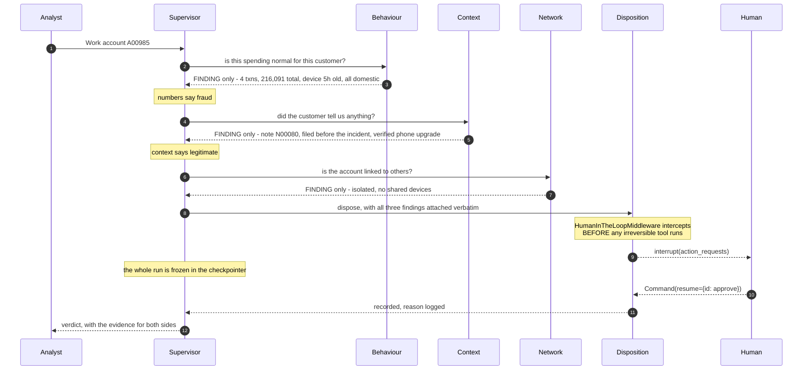

<div align="center">

# Sentinel

### A multi-agent system that triages 276 flagged accounts and produces a defensible verdict for every one.

</div>

---

## The problem

Eight automated rules fired over a weekend. 411 alerts on 276 accounts. Roughly two
thirds of them did nothing wrong.

The hard part is not the SQL. The database will readily report that an account made
four transactions totalling 216,091 from a device first seen that morning. What it
will not volunteer is that a colleague typed an explanation five hours earlier:

> *"Support chat. Customer upgraded their phone on the 14th and could not log in.
> Walked them through re-registration. Verified with video KYC."*
> — note `N00080`, filed **before** the alert fired

**No rule is reliable.** The best is right 59% of the time; the worst, 23%. The two
that fire most are the two least reliable.

And a real share of the queue genuinely cannot be resolved. `insufficient_evidence`
is a real verdict here, and it has to name what would settle it.

---

## Quick start

```bash
uv venv --python 3.12 .venv
.venv\Scripts\activate                  # or: source .venv/bin/activate
uv pip install -e ".[dev]"

cp .env.example .env                     # then add your OPENAI_API_KEY

python -m sentinel.doctor                # environment, DB integrity, sample case
python -m sentinel.tools                 # tool isolation report
```

`data/sentinel.db` ships with the repository. No downloads, no setup beyond a key.

Two modes, exactly as the assignment specifies:

```bash
sentinel case A00985 --show-trail        # one account, full reasoning trail
sentinel sweep                           # all 276 in the background, job id immediately
```

---

## Architecture

```
Layer 3   supervisor          decides who to ask, and in what order
Layer 2   four specialists    natural language in, natural language out
Layer 1   SQLite-backed tools exact arguments, real rows
```

The one architectural move that creates this shape is `@tool` wrapping an agent's
`.invoke()`. Everything else is prompt and plumbing.

| | Reads | Answers |
|---|---|---|
| **Behaviour** | 108,249 transactions | Is this spending normal *for this customer*? |
| **Context** | 260 case notes, 86 disputes, 200 prior cases | Did the customer already explain this? |
| **Network** | devices and merchants across accounts | Is this account acting alone? |
| **Disposition** | writes, does not read | What do we do, and who has to approve it? |

### The isolation boundary

```python
result  = specialist.invoke({"messages": [{"role": "user", "content": ...}]})
finding = result["messages"][-1].text      # <- everything else dies here
```

Each specialist runs on a **fresh message list**. Its tool calls — hundreds of
database rows — live and die inside `result`. One line crosses back.

**Measured: 95.6% of what the specialists produced never reached the supervisor.**
`python -m sentinel.analysis` reports this for any run.

Structured findings ride back on a *state key*, never in the message list, so the
supervisor's model never re-reads them — but the report writer and the evidence
audit can.

### How one case runs



---

## The five requirements

### 1 · Four specialist subagents &nbsp;`required`

Each holds only its own domain's tools, and swapping them would visibly break the
system.

```
behaviour    7 tools   get_alerts, get_incident_activity, get_spending_baseline,
                       get_device_history, get_geography,
                       get_high_risk_merchant_activity, get_limit_utilisation
context      4 tools   get_customer_profile, get_case_notes, get_disputes, get_prior_cases
network      3 tools   get_shared_devices, get_device_peers, get_merchant_overlap
disposition  3 tools   record_disposition, block_card, escalate_case
```

**Done when** — `python -m sentinel.tools` prints the sets and confirms they are
pairwise disjoint, and that Disposition holds no read tool at all.

### 2 · A supervisor that only routes &nbsp;`required`

Four tools, no database access, and the ordering is enforced rather than requested:
`consult_disposition_officer` inspects `specialists_consulted` and returns an error
`ToolMessage` if Context has not been asked yet.

> *"REFUSED: you cannot dispose of a case before reading the file. The numbers alone
> reach 78% on this queue and this account may well be one of the two thirds that
> did nothing wrong."*

### 3 · Asynchronous queue sweep &nbsp;`required`

The three-tool pattern: `start_queue_sweep`, `check_sweep_status`,
`collect_sweep_results` (`src/sentinel/sweep.py`).

Starting a sweep does three cheap things — one `SELECT DISTINCT account_id FROM
alerts`, one job row, one `Thread.start()` — and returns.

**Measured at 0.0057 s.** The rubric asks for under five seconds.

### 4 · Policy in documents, loaded on demand &nbsp;`optional, credited`

Five editable Markdown files with YAML front-matter in `src/sentinel/policies/`:

| Document | What it carries |
|---|---|
| `fraud_typologies` | Each typology's signature, what a false positive looks like, what decides |
| `narrative_reading` | The three tests — timing, subject, specificity |
| `risk_appetite` | Verdict thresholds, evidence ranking, segment and KYC baselines |
| `escalation_matrix` | Action table with a reversibility column, approval rules |
| `evidence_standards` | Citation requirements, worked examples, honest `insufficient_evidence` |

Level 1 (names + descriptions, **1,117 chars**) goes into every system prompt.
Level 2 (the **31,211-char** bodies) loads only when an agent asks. **96.5% of the
corpus is absent from a prompt until it is needed.**

Loading is not optional where it matters. `PolicyGateMiddleware` short-circuits
`wrap_tool_call` and returns an error without running the tool:

```python
POLICY_GATES = {
    "record_disposition": "evidence_standards",
    "block_card":         "escalation_matrix",
    "escalate_case":      "escalation_matrix",
}
```

The catalog is re-scanned on **every model call**, so editing a file changes
behaviour with no code change and no restart. `python -m sentinel.policy_skills`
demonstrates that by writing a document while the process is running.

Every load is recorded in `policy_loads`, so on-demand loading is provable after a
run rather than merely claimed.

### 5 · Human approval before anything irreversible &nbsp;`required`

`HumanInTheLoopMiddleware` on the **disposition subagent** (where the dangerous tools
are); the checkpointer on the **supervisor** (the run that has to freeze and thaw).
Getting that backwards gives you nested persistence and an interrupt with nowhere to
live.

`block_card` and `escalate_case` allow `approve` and `reject` only — no `edit`,
because silently rewriting *which* card gets blocked is the failure an approval gate
exists to prevent. `record_disposition` is reversible and never interrupts.

Both paths are in `docs/transcripts/`:

| | Result |
|---|---|
| **Paused** | `status=awaiting_approval`, **0 rows in the actions table** |
| **Approved** | resumed with `Command(resume={"decisions": [{"type": "approve"}]})` → executed, `approved_by=analyst` |
| **Rejected** | resumed with `{"type": "reject", "message": ...}` → **0 action rows**, and **not retried** |

During a sweep there is no human present, so irreversible actions are *proposed and
queued* (`sentinel approvals`), never executed. An unattended run that could block
276 cards is a worse system than one that cannot.

---

## What stops it inventing things

Three layers, in the order they fire — `src/sentinel/policy.py`.

**1 · Shape.** `ALxxxx1` is a placeholder and `R02` is a rule id where an alert id
belongs. Both are refused with an explanation the model can act on.

**2 · Ownership.** Every citation is resolved back to a real row and confirmed to
belong to *this* account. `AL0001` is a perfectly valid alert id — it belongs to
A00832.

**3 · Quotes.** For anything a human wrote, the quoted words are checked against the
stored text.

Then `python -m sentinel.reports` re-runs all of it over every recorded disposition
and writes `EVIDENCE_AUDIT.md`.

Alongside those: a `legitimate` verdict must cite text a human wrote,
`insufficient_evidence` must name the missing artefact, and no action may contradict
its verdict.

> The policy documents teach. The code guarantees.

---

## The source database is never modified

```python
sqlite3.connect(f"file:{path}?mode=ro", uri=True)   # + PRAGMA query_only = 1
```

An `INSERT` raises `OperationalError`, rather than being filtered out by a pattern.
Everything this system writes goes to `runtime/actions.db`, a different file.

`python -m sentinel.doctor` proves it on every run:

```
write attempt          refused (attempt to write a readonly database)
```

---

## Two findings that shaped the design

**`triggered_at` is the start of the episode, not the offending transaction.** In
**342 of 411 alerts** the transaction named by `trigger_txn_id` happens *after*
`triggered_at`, by up to eighteen hours. A window measured backwards from
`triggered_at` therefore excludes the activity that caused the alert — on A00985 it
reports 36,861 across one transaction when the real episode is 216,091 across four.
Every window is anchored on `incident_window()` instead.

**Timing is what makes a note evidence.** Across alerted accounts, 179 notes were
filed *before* the incident and 71 *after*. A note filed before is a pre-existing
explanation. A note filed after is the customer's reaction — and *"I did not make
these transactions"* corroborates fraud rather than explaining it. Every narrative
row carries `days_before_alert` and a `timing` label computed in SQL, because
language models are poor at date arithmetic and this distinction decides a large
part of the queue.

---

## Commands

```bash
sentinel doctor                      # environment, DB integrity, sample case
sentinel case A00985 --show-trail    # one account, every specialist's finding
sentinel case A00782 --auto          # skip approval prompts, defer actions
sentinel sweep                       # all 276, live progress
sentinel sweep --limit 20 --detach   # dev subset, return the job id and exit
sentinel status <job_id>             # progress, without blocking
sentinel collect <job_id>            # the verdicts
sentinel approvals                   # irreversible actions queued for review
sentinel policies                    # progressive disclosure + hot-reload demo
sentinel analyse                     # measured cost, isolation, single-agent model
sentinel report                      # DISPOSITIONS.md, CASES.md, WRITEUP.md, EVIDENCE_AUDIT.md
sentinel reset                       # drop run state; never touches data/sentinel.db
```

Every command is also a module, so nothing needs the console script installed:
`python -m sentinel.doctor`, `python -m sentinel.tools`,
`python -m sentinel.policy_skills`, `python -m sentinel.analysis`,
`python -m sentinel.reports`, `python -m sentinel.hitl`.

---

## Layout

```
src/sentinel/
  config.py            paths, models, sweep workers, the frozen clock (2 Mar 2026)
  db.py                read-only source DB (mode=ro + query_only + sha256) | runtime DB
  queries.py           every SQL query, grouped by domain. No LLM.
  policy.py            shape / ownership / quote checks, and the hard rules
  policy_skills.py     progressive disclosure + the two middlewares
  agents.py            four specialists, four wrappers, the supervisor
  sweep.py             run_case / resume_case, and the three sweep tools
  analysis.py          tokens, the isolation boundary, the single-agent model
  reports.py           the four generated deliverables
  hitl.py              the approve and reject transcripts
  doctor.py  cli.py    operator surfaces
  tools/               one module per domain, plus the registry and isolation check
  policies/            five editable .md policy documents
notebooks/             the build, one concept per notebook
docs/                  transcripts/
data/sentinel.db       read-only, hash-verified
runtime/               everything written at run time (gitignored)
```

---

## Deliverables

| File | What it holds |
|---|---|
| `DISPOSITIONS.md` | Verdict, confidence, reasoning and cited evidence for every account |
| `CASES.md` | Three worked cases with every specialist's finding in full |
| `WRITEUP.md` | Measured tokens, the single-agent comparison, and the most exposed call |
| `EVIDENCE_AUDIT.md` | Every citation resolved back to a database row |
| `docs/transcripts/` | Approve and reject transcripts of the approval gate |

All generated from recorded results — `sentinel report` — so no number in a
deliverable can drift from what the system actually decided.

---

## Rules observed

- Everything is local. No network at run time except the model API.
- `data/sentinel.db` is opened read-only and its hash is verified.
- Framework: LangChain 1.3 `create_agent` on LangGraph 1.2.
