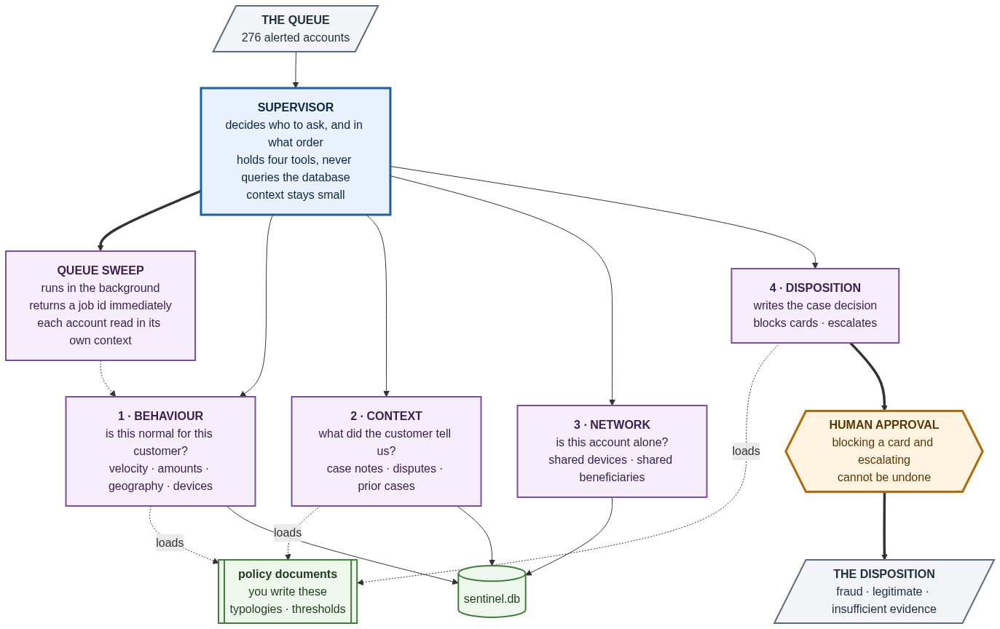
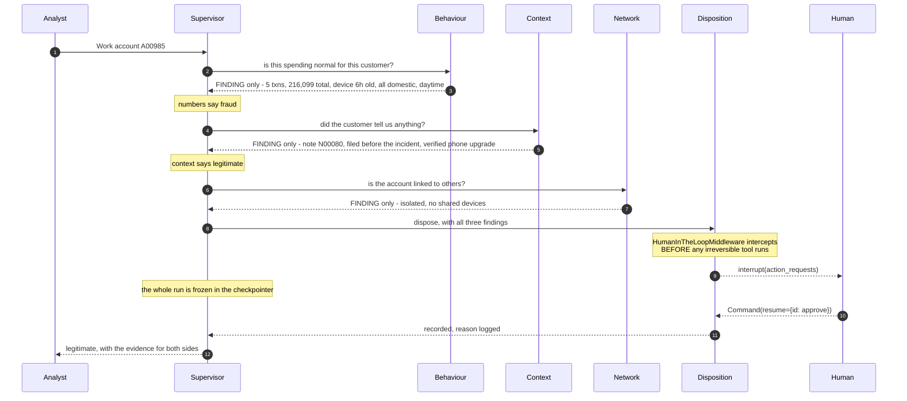

<div align="center">

# Sentinel

### A multi-agent system that triages 276 flagged accounts and produces a defensible verdict for every one.

</div>

---

## The problem

Eight automated rules fired over a weekend. 411 alerts on 276 accounts. Roughly two
thirds of them did nothing wrong.

The hard part is not the SQL. The database will readily report that an account made
six transactions in forty minutes from a foreign IP. What it will not volunteer is
that a colleague typed an explanation two weeks earlier:

> *"Customer upgraded their phone on the 14th and could not log in. Walked them through
> re-registration. Verified with video KYC."* — note `N00080`, filed five hours before
> the alert fired

**No rule is reliable.** The best is right 59% of the time; the worst, 23%. The two
that fire most are the two least reliable. Grid-searching numeric rules tops out at
78%. Reading the case notes reaches 92%.

And about 30% of the hard cases genuinely cannot be resolved. `insufficient_evidence`
is a real verdict here, and it has to name what would settle it.

---

## Quick start

```bash
python -m venv .venv && .venv/Scripts/activate      # or: source .venv/bin/activate
pip install -e ".[dev]"
cp .env.example .env                                 # add your OPENAI_API_KEY

sentinel doctor                                      # environment, DB integrity, tool isolation
pytest -q                                            # 92 conformance tests, no API key needed
```

Two modes, exactly as the assignment specifies:

```bash
sentinel case A00985 --show-trail                    # one account, full reasoning trail
sentinel sweep                                       # all 276 in the background, job id immediately
```

`data/sentinel.db` ships with the repository. No downloads, no setup beyond a key.

---

## Architecture



```
Layer 3   supervisor          decides who to ask, and in what order
Layer 2   four specialists    natural language in, natural language out
Layer 1   SQLite-backed tools exact arguments, real rows
```

The one architectural move that creates this shape is `@tool` wrapping an agent's
`.invoke()`. Everything else is prompt and plumbing.

| | Reads | Answers |
|---|---|---|
| **Behaviour** | 108,249 transactions | Is this spending normal *for this customer*? |
| **Context** | 260 case notes, 86 disputes, 200 prior cases | Did the customer already explain this? |
| **Network** | devices and merchants across accounts | Is this account acting alone? |
| **Disposition** | writes, does not read | What do we do, and who has to approve it? |

Each lives in its own module with its own prompt and its own tools:
`sentinel/agents/{behaviour,context,network,disposition}.py`.

### The isolation boundary

```python
# sentinel/agents/_boundary.py
result = agent.invoke({"messages": [{"role": "user", "content": ...}]})
finding = final_text(result)          # <- everything else dies here
return Command(update={"messages": [ToolMessage(finding, tool_call_id)], ...})
```

Each specialist runs on a **fresh message list**. Its tool calls — hundreds of
database rows — live and die inside `result`. One line crosses back.

Measured on a single case: **45,317 characters produced inside the specialists,
4,833 crossed — 89.3% discarded.** `sentinel analyse tokens` reports this for any run.

Structured findings ride back on a *state key*, never in the message list, so the
supervisor's model never reads them — but the report writer and the evidence audit can.

### How one case runs



---

## The five requirements

### 1 · Four specialist subagents &nbsp;`required`

Each holds only its own domain's tools, and swapping them would visibly break the
system.

```
behaviour    7 tools   get_alerts, get_incident_activity, get_spending_baseline,
                       get_device_history, get_geography,
                       get_high_risk_merchant_activity, get_limit_utilisation
context      4 tools   get_customer_profile, get_case_notes, get_disputes, get_prior_cases
network      3 tools   get_shared_devices, get_device_peers, get_merchant_overlap
disposition  3 tools   record_disposition, block_card, escalate_case
```

**Done when** — `sentinel doctor` prints the sets and confirms they are pairwise
disjoint. `tests/test_architecture.py` asserts it, and asserts that Disposition holds
no read tool at all.

### 2 · A supervisor that only routes &nbsp;`required`

Four tools, no database access, and the ordering is enforced rather than requested:
`consult_disposition_officer` inspects `specialists_consulted` and returns an error
`ToolMessage` if Context has not been asked yet.

**Done when** — `test_supervisor_module_has_no_database_access` parses the module's
import graph and asserts no repository or `sentinel.db` import exists.
`test_supervisor_holds_exactly_four_tools` counts the wrappers.

### 3 · Asynchronous queue sweep &nbsp;`required`

The three-tool pattern: `start_queue_sweep`, `check_sweep_status`,
`collect_sweep_results` (`sentinel/tools/sweep_tools.py`).

Starting a sweep does three cheap things — one `SELECT DISTINCT account_id FROM
alerts`, one job row, one `Thread.start()` — and returns.

**Done when** — **measured at 0.041 s.** `tests/test_sweep.py` asserts under one
second. Verifiable from outside the process:

```bash
uvicorn sentinel.api:app &
curl -w '%{time_total}s\n' -XPOST localhost:8000/sweep
```

> The sweep tools sit on the operator surface (CLI/API), **not** on the supervisor.
> RUBRIC.md caps the supervisor at four tools and it already holds four specialists.
> The relationship runs the other way: the sweep *drives* the supervisor, one
> isolated invocation per account.

### 4 · Policy in documents, loaded on demand &nbsp;`optional, credited`

Five editable Markdown files with YAML front-matter in `sentinel/policies/`:

| Document | What it carries |
|---|---|
| `fraud_typologies` | Seven typologies: signature, what a false positive looks like, what decides |
| `narrative_reading` | The three tests — timing, subject, specificity — and explain/disown/mule |
| `risk_appetite` | Verdict thresholds, evidence ranking, segment and KYC baselines |
| `escalation_matrix` | Action table with a reversibility column, approval and rejection rules |
| `evidence_standards` | Citation requirements, worked examples, honest `insufficient_evidence` |

Level 1 (names + descriptions, 992 chars) goes into every system prompt. Level 2 (the
28,526-char bodies) loads only when an agent asks. **97% of the corpus is absent from
a prompt until it is needed.**

Loading is not optional where it matters. `PolicyGateMiddleware` short-circuits
`wrap_tool_call` and returns an error without running the tool:

```python
PolicyGateMiddleware({
    "record_disposition": "evidence_standards",
    "block_card":         "escalation_matrix",
    "escalate_case":      "escalation_matrix",
})
```

**Done when** — `test_no_policy_body_is_baked_into_any_system_prompt` takes a probe
line from the middle of each document and asserts it appears in no prompt. Every load
is recorded in `policy_loads`, so on-demand loading is provable after a run.

Edit any of these files and behaviour changes with no code change — the catalog is
re-scanned on every model call.

### 5 · Human approval before anything irreversible &nbsp;`required`

`HumanInTheLoopMiddleware` on the **disposition subagent** (where the dangerous tools
are); the checkpointer on the **supervisor** (the run that has to freeze and thaw).
Getting that backwards gives you nested persistence and an interrupt with nowhere to
live.

`block_card` and `escalate_case` allow `approve` and `reject` only — no `edit`,
because silently rewriting *which* card gets blocked is the failure an approval gate
exists to prevent. `record_disposition` is reversible and never interrupts.

Both paths are demonstrated in `docs/transcripts/`:

| | Result |
|---|---|
| **Paused** | `status=awaiting_approval`, **0 rows in the actions table** |
| **Approved** | resumed with `Command(resume={id: {"decisions": [{"type": "approve"}]}})` → action executed, `approved_by=analyst` |
| **Rejected** | resumed with `{"type": "reject", "message": ...}` → **0 action rows**, downgraded to `monitor`, **not retried** |

During a sweep there is no human present, so irreversible actions are *proposed and
queued* (`sentinel approvals`), never executed. An unattended run that could block
cards is a worse system than one that cannot.

---

## What stops it inventing things

Three layers, in order of when they fire.

**1 · Shape.** `record_disposition` checks every identifier against the pattern for
its kind. `ALxxxx1` is a placeholder and `R02` is a rule id where an alert id belongs;
both are refused with an explanation the model can act on.

**2 · Ownership and quotes.** Every citation is resolved back to a real row and
confirmed to belong to *this* account — `AL0001` is a perfectly valid alert id that
belongs to A00832 — and for anything a human wrote, the quoted words are checked
against the stored text.

**3 · Audit.** `sentinel analyse evidence` re-runs all of it over every recorded
disposition and writes `reports/evidence_audit.md`.

The reference this project follows puts it well: *a subagent's final message is a
claim; your code should be able to tell a claim from a fact.*

Alongside those, `sentinel/policy.py` holds the rules that are checked rather than
taught — a `legitimate` verdict must cite text a human wrote, `insufficient_evidence`
must name the missing artefact, and no action may contradict its verdict.

> The policy documents teach. The code guarantees.

---

## The source database is never modified

```python
sqlite3.connect(f"file:{path}?mode=ro", uri=True)   # + PRAGMA query_only = 1
```

An `INSERT` raises `OperationalError`, rather than being filtered out by a pattern.
Everything this system writes goes to `runtime/actions.db`, a different file:
dispositions, actions, sweep jobs, the token ledger, the policy-load ledger, findings,
and an audit log.

A SHA-256 recorded at setup is checked by `sentinel doctor` and asserted by the test
suite before and after it runs.

---

## Commands

```bash
sentinel doctor                      # environment, DB integrity, tool isolation
sentinel case A00985 --show-trail    # one account, every specialist's finding
sentinel case A00782 --auto          # skip approval prompts, defer actions
sentinel sweep                       # all 276, live progress
sentinel sweep --limit 15 --detach   # dev subset, return the job id and exit
sentinel status <job_id>             # progress, without blocking
sentinel collect <job_id>            # the verdicts
sentinel approvals                   # irreversible actions queued for review
sentinel analyse evidence            # re-check every citation against the database
sentinel analyse lookalikes          # identical signatures, opposite verdicts
sentinel analyse tokens              # measured cost and the single-agent comparison
sentinel report all                  # DISPOSITIONS.md, CASES.md, WRITEUP.md
sentinel reset                       # drop run state; never touches data/sentinel.db
```

HTTP mirrors all of it: `uvicorn sentinel.api:app --reload`, docs at `/docs`.

---

## Layout

```
sentinel/
  config.py            paths, models, rate limits, the frozen clock
  db.py                ReadOnlyDB (mode=ro + query_only + sha256) | ActionsDB | token ledger
  queries.py           every SQL query, grouped by domain. No LLM.
  policy.py            Verdict, Confidence, EvidenceRef, Disposition + the hard rules
  sweep.py             run_case / resume_case, and the background queue sweep
  analysis.py          evidence audit, lookalike pairs, token model
  reports.py           the four generated deliverables
  cli.py  api.py       operator surfaces
  agents/
    behaviour.py context.py network.py disposition.py   one prompt each
    supervisor.py      four tools, no DB access
    _boundary.py       the isolation boundary
  tools/               one module per domain, plus the registry in __init__
  policies/            five editable .md policy documents
tests/                 92 offline conformance tests
docs/                  SPEC.md, ARCHITECTURE.md, RUBRIC-MAPPING.md, architecture.png, transcripts/
data/sentinel.db       read-only, hash-verified
runtime/               everything written at run time (gitignored)
```

---

## Two findings that shaped the design

**`triggered_at` is the start of the episode, not the offending transaction.** In
**342 of 411 alerts** the transaction named by `trigger_txn_id` happens *after*
`triggered_at`, by up to twelve hours. A window measured backwards from `triggered_at`
therefore excludes the activity that caused the alert — on A00985 it reports 36,869
across two transactions when the real episode is 216,099 across five. Every window is
anchored on an incident window instead. See `sentinel/repositories/alerts_repo.py`.

**Timing is what makes a note evidence.** Across alerted accounts, 248 notes were
filed *before* the incident and 137 *after*. A note filed before is a pre-existing
explanation. A note filed after is the customer's reaction — and *"I did not make
these transactions"* corroborates fraud rather than explaining it. Every narrative row
carries `days_before_alert` and a `timing` label computed in SQL, because language
models are poor at date arithmetic and this distinction decides a third of the queue.

---

## Deliverables

| File | What it holds |
|---|---|
| `DISPOSITIONS.md` | Verdict, confidence, reasoning and cited evidence for all 276 |
| `CASES.md` | Three worked cases with every specialist's finding in full |
| `WRITEUP.md` | Measured tokens, the single-agent comparison, and the most exposed call |
| `reports/evidence_audit.md` | Every citation resolved back to a database row |
| `docs/SPEC.md` | The design specification |
| `docs/transcripts/` | Approve and reject transcripts of the approval gate |

All generated from recorded results — `sentinel report all` — so no number in a
deliverable can drift from what the system actually decided.

---

## Rules observed

- Everything is local. No network at run time except the model API.
- `data/sentinel.db` is opened read-only and its hash is verified.
- Framework: LangChain 1.3 `create_agent` on LangGraph 1.2.
