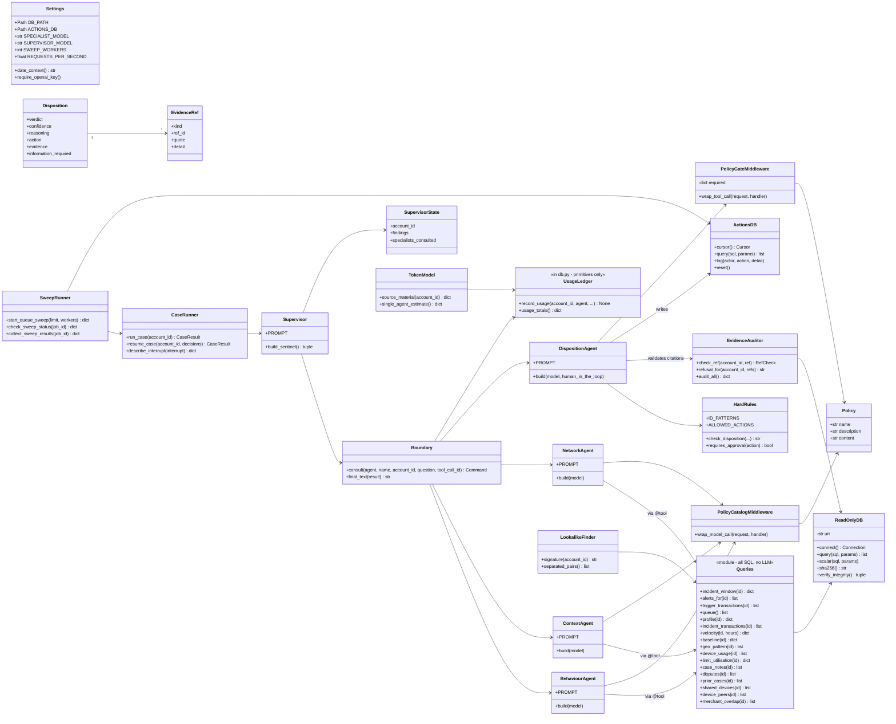
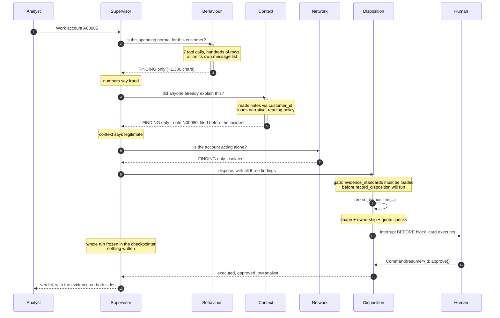

# Architecture

Three views: the system as the assignment draws it, the static structure, and what
happens on one case.

---

## 1 · The system


Rendered from the assignment README's own mermaid source, unchanged.

```
Layer 3   supervisor           routes; four tools; no database access
Layer 2   four specialists     natural language in, natural language out
Layer 1   SQLite-backed tools  exact arguments, real rows
```

Two documented deviations from that drawing:

1. **Network also loads policy.** The arrow is missing in the brief, but
   mule-ring-versus-family-tablet is a policy judgement.
2. **The three sweep tools sit on the operator surface, not the supervisor.**
   `RUBRIC.md` caps the supervisor at four tools. The sweep *drives* the supervisor —
   one isolated invocation per account — rather than being called by it.

---

## 2 · Static structure



Note what the diagram does *not* contain: an edge from `Supervisor` to `Queries` or
to either database. That absence is the requirement, and `tests/test_architecture.py`
asserts it two ways - by parsing the supervisor module's import graph, and by reading
which tool objects the supervisor is actually handed.

---

## 3 · One case



**Order matters and is enforced.** `consult_disposition_officer` reads
`specialists_consulted` from state and refuses while `context` is absent — a verdict
written before anyone looked for an explanation is the exact failure this desk exists
to prevent.

---

## 4 · Where the saving comes from

```
supervisor messages: [ system,
                       human("Work A00985"),
                       ai(tool_call behaviour), tool("FINDING: ...")   <- ~1,300 chars
                       ai(tool_call context),   tool("FINDING: ...")   <- ~1,100 chars
                       ai(tool_call network),   tool("FINDING: ...")   <-   ~460 chars
                       ai(tool_call disposition), tool("FINDING: ...")
                       ai(final answer) ]
```

Each specialist's tool results — the actual database rows — never appear in that list.
They live on the specialist's own message list, which is discarded when
`consult()` returns.

Measured on one case: **45,317 characters produced inside, 4,833 crossed, 89.3%
discarded.** `sentinel analyse tokens` reports it for any run;
`WRITEUP.md` carries the figure for the full sweep alongside the derived
single-agent comparison.

---

## 5 · Control points

Every guarantee in this system is code, not prompt. In the order they fire:

| Point | Mechanism | File |
|---|---|---|
| Source data cannot be written | `mode=ro` URI + `PRAGMA query_only` | `db.py` |
| Supervisor cannot query | no repository import exists | `agents/supervisor.py` |
| Specialists cannot cross domains | `DOMAIN_TOOLS`, asserted disjoint | `tools/__init__.py` |
| Context before disposition | state check → error `ToolMessage` | `agents/supervisor.py` |
| Policy read before a verdict | `PolicyGateMiddleware` short-circuits the call | `agents/disposition.py` |
| Verdict internally consistent | `check_disposition` | `policy.py` |
| Identifiers well formed | `ID_PATTERNS` | `policy.py` |
| Citations real and owned | `analysis.refusal_for` | `analysis.py` |
| Nothing irreversible unapproved | `HumanInTheLoopMiddleware` before the tool body | `agents/disposition.py` |
| Sweep never acts unattended | `approval_mode="defer"` | `tools/disposition_tools.py` |
