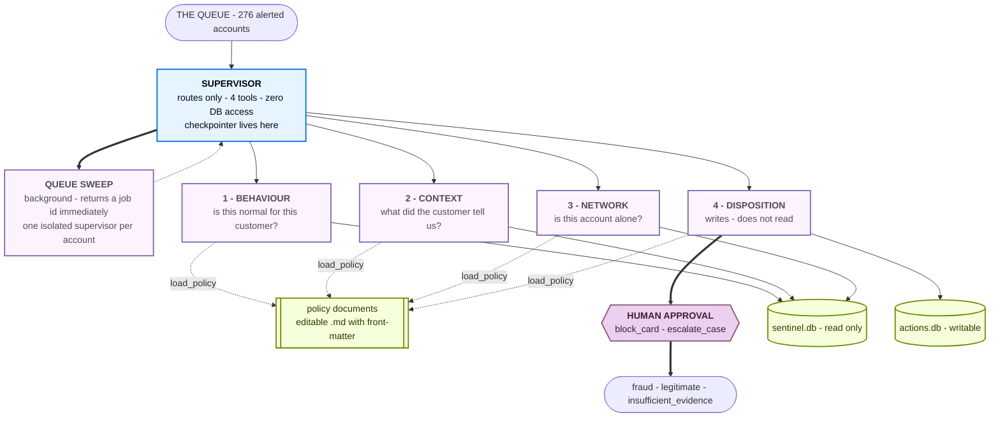

# Sentinel — Design Specification

## 1. The problem

276 accounts were flagged over the weekend by eight automated rules. Roughly
two thirds of them did nothing wrong. The system must produce a defensible
verdict for every one.

The difficulty is not the SQL. The database will readily report that an account
made six transactions in forty minutes from a foreign IP. What it will not
volunteer is that a colleague typed an explanation two weeks earlier.

**No rule is reliable.** Measured true-positive rates on this queue:

| Rule | Detects | Fired | TP rate |
|---|---|---:|---:|
| R01 | >6 authorisations on one card within 60 min | 66 | 59% |
| R07 | Transaction >40,000 between 01:00 and 05:00 | 37 | 59% |
| R08 | Cumulative spend crosses 90% of limit within 48h | 47 | 51% |
| R04 | ≥5 authorisations under 100 within 30 min | 49 | 45% |
| R05 | ≥3 crypto/giftcard/moneytransfer txns in 24h | 41 | 44% |
| R03 | Two authorisations, different countries, <3h apart | 83 | 24% |
| R02 | Transaction >25,000 from a device first seen in 24h | 88 | 23% |

The two rules that fire most are the two least reliable.

Grid-searching numeric rules tops out at **78%**. Always answering "legitimate"
scores **66%**. Reading the case notes reaches **92%**. Those fourteen points
are the assignment.

Around **30% of hard cases cannot be resolved** from what is on file.
`insufficient_evidence` is a real verdict that scores; confident guessing does not.

## 2. What the data actually contains

Verified against `data/sentinel.db` (SHA-256 recorded in `data/sentinel.db.sha256`).

| Table | Rows | Notes |
|---|---:|---|
| `transactions` | 108,249 | 2 Nov 2025 – 2 Mar 2026 |
| `alerts` | 411 | on **276** distinct accounts; 277 high, 134 medium |
| `customers` / `accounts` | 1,200 / 1,200 | segments: retail, affluent, student, business |
| `cards` | 1,458 | |
| `devices` / `customer_devices` | 1,520 / 1,548 | 16 devices shared between customers |
| `merchants` | 400 | crypto/giftcard/moneytransfer/gaming carry the top risk scores |
| `case_notes` | 260 | **keyed on `customer_id`** |
| `disputes` | 86 | keyed on `txn_id` |
| `prior_cases` | 200 | 54 confirmed_fraud, 124 false_positive, 22 insufficient_evidence |

There is no `is_fraud` column.

### Two findings that shaped the design

**1. `triggered_at` is the start of the episode, not the offending transaction.**
In **342 of 411 alerts** the transaction named by `trigger_txn_id` occurs
*after* `triggered_at`, by up to twelve hours. A window measured backwards from
`triggered_at` therefore excludes the activity that caused the alert. On
A00985 that error reports 36,869 across two transactions when the real episode
is 216,099 across five.

Every window in this system is anchored on an **incident window**:

```
incident_start = MIN(triggered_at) on the account
incident_end   = MAX(triggered_at, its trigger transaction's ts)
```

**2. Narrative coverage is high, and timing is the discriminator.**
Of the 276 alerted accounts: 250 have case notes, 86 have disputes, 53 have
prior cases, and only **7 are entirely silent**. Across alerted accounts, 248
notes were filed *before* the incident and 137 *after*.

That split is the reasoning axis. A note filed before is a pre-existing
explanation. A note filed after is the customer's reaction — and *"I did not
make these transactions"* corroborates fraud rather than explaining it.

The notes are drawn from ~34 templates that fall into three families:

- **The customer explains** — travel notice, verified phone upgrade, spouse on a
  supplementary card, planned large purchase, business invoicing, seasonal spend,
  shared family tablet, child at university abroad.
- **The customer disowns** — unrecognised small amounts while holding the card,
  an unrequested device-registration SMS, a stolen wallet with a police report.
- **The mule pattern** — evasive about the source of incoming transfers, asked
  by a friend to receive money and forward it on.

The system must not hard-code a template→verdict lookup. That is counting, not
reading, and it would not generalise. The policy documents teach the *tests*;
the model applies them.

## 3. Architecture



### Two documented deviations from the brief's diagram

1. **Network also loads policy.** The brief's arrow skips it, but
   mule-ring-versus-family-tablet is squarely a policy judgement.
2. **The three sweep tools sit on the operator surface (CLI/API), not on the
   supervisor.** `RUBRIC.md` requires the supervisor hold *"four tools
   maximum"*; adding start/status/collect would make seven. The sweep still
   drives the supervisor — one isolated invocation per account.

## 4. The isolation mechanism

```python
def _consult(agent, name, account_id, question, tool_call_id) -> Command:
    result = agent.invoke(
        {"messages": [{"role": "user", "content": f"Account {account_id}.\n\n{question}"}]}
    )
    finding = _final_text(result)          # <- the boundary
    return Command(update={"messages": [ToolMessage(finding, tool_call_id)], ...})
```

Each specialist runs on a **fresh message list**. Its tool calls — each
returning hundreds of database rows — live and die inside `result`. One line
crosses back.

Measured on a single case (A00985): 45,317 characters produced inside the
specialists, 4,833 crossed. **89.3% discarded at the boundary.**

The structured findings ride back on a *state key* (`findings`), never in the
message list, so the supervisor's model never sees them — but the report writer
and evidence audit can work from identifiers instead of re-parsing prose.

## 5. Guarantees implemented in code, not prompt

| Guarantee | Mechanism |
|---|---|
| Source database never modified | `file:...?mode=ro` URI + `PRAGMA query_only=1`; writes go to a separate `runtime/actions.db`; SHA-256 verified |
| Supervisor holds exactly four tools | `build_sentinel` passes only the four wrappers; its module imports no repository |
| Specialists hold only their own tools | `tools/__init__.py` `DOMAIN_TOOLS`; asserted pairwise disjoint |
| Context is read before disposition | `consult_disposition_officer` inspects `specialists_consulted` and returns an error `ToolMessage` if `context` is absent |
| Policy is read before a verdict is written | `PolicyGateMiddleware({"record_disposition": "evidence_standards"})` short-circuits `wrap_tool_call` |
| `insufficient_evidence` names its gap | `policy.check_disposition` refuses an empty `information_required` |
| `legitimate` cites human text | `check_disposition` requires a `case_note`/`dispute`/`prior_case` with a verbatim quote |
| No irreversible action without approval | `HumanInTheLoopMiddleware` interrupts *before* the tool body runs; sweep mode defers instead |

The reference class puts it well: **the policy documents teach, the code guarantees.**

## 6. Policy documents

Five editable Markdown files with YAML front-matter, in `sentinel/policies/`.
Level-1 (name + description, 992 chars) is injected into every system prompt;
level-2 (the 28,526-char bodies) loads only on demand. **97% of the policy
corpus is absent from a prompt until an agent asks for it.**

| Document | Purpose |
|---|---|
| `fraud_typologies` | Seven typologies: signature, what a false positive looks like, what decides between them |
| `narrative_reading` | The three tests — timing, subject, specificity — and the explain/disown/mule families |
| `risk_appetite` | Verdict thresholds, evidence ranking, segment and KYC baselines |
| `escalation_matrix` | Action table with a reversibility column, approval rules, rejection handling |
| `evidence_standards` | Citation requirements, worked defensible/indefensible examples, honest `insufficient_evidence` |

## 7. Modes

| Mode | Entry | Returns |
|---|---|---|
| Single case | `sentinel case A00985` | Verdict plus the full reasoning trail |
| Queue sweep | `sentinel sweep` | A job id immediately; 276 accounts worked in the background |

The sweep uses the three-tool pattern: `start_queue_sweep`,
`check_sweep_status`, `collect_sweep_results`. Start does one
`SELECT DISTINCT account_id FROM alerts`, one job row insert, and one thread
start, then returns — sub-second by construction.

## 8. Deliverables

Generated from recorded results, not written by hand:

- `DISPOSITIONS.md` — all 276 accounts: verdict, confidence, reasoning
- `CASES.md` — three worked cases with each specialist's trail
- `WRITEUP.md` — measured sweep tokens, a derived single-agent estimate, and
  the system's most defensible error
- `EVIDENCE_AUDIT.md` — every citation resolved back to a database row
